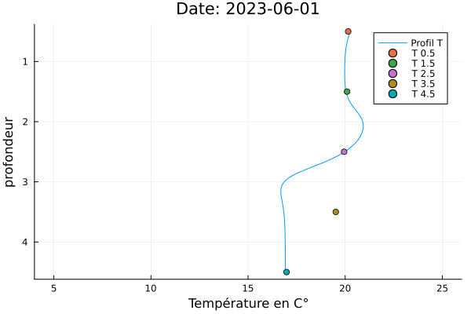
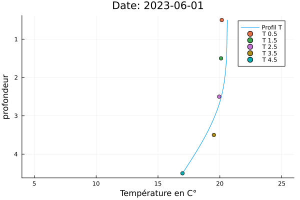

# Prédiction et Modélisation de la Température et de la Concentration en Chlorophylle d'un Lac par Deep Learning

**Remarque :** Ce ReadMe a pour objectif de présenter brièvement les enjeux et les résultats du stage. Les codes sont disponibles dans ce dépôt et illustrent le travail réalisé pour obtenir les résultats partiels présentés.
**Remarque :** En conclusion j'expose les compétences principales développées lors de ce stage.

Ce stage vise à effectuer des prédictions et des modélisations sur des variables d'intérêt d'un lac français, dans le but de suivre l'évolution des cyanobactéries. Ces organismes sont nuisibles pour la biodiversité ainsi que pour la santé humaine. L'introduction présentera le raisonnement et les outils utilisés durant le stage. Les sections suivantes exposeront les résultats obtenus.

## Introduction

La concentration en cyanobactéries est une variable difficile à prédire. Nous nous concentrons donc sur la température et la concentration en chlorophylle. Dans un premier temps, nous avons tenté de prédire ces deux variables à l'aide de séries temporelles en utilisant des cellules LSTM. Les résultats n'étant pas satisfaisants en raison du manque d'informations transmises par les données, nous avons intégré nos connaissances physiques dans les données. Pour ce faire, nous avons utilisé les PINNs (Physics-Informed Neural Networks), qui permettent d'incorporer des contraintes physiques dans un réseau de neurones. Nous cherchons désormais à modéliser plutôt qu'à prédire. Pour cette partie, nous nous concentrons sur la température.

## Résultats de Prédiction

Après avoir traité et nettoyé les données, et découpé le jeu de données en plusieurs sous-ensembles, nous présentons les résultats sur l'ensemble de test.

Les résultats sont obtenus avec une cellule LSTM. Nous prédisons la température de l'eau à 0,5 m de profondeur en utilisant comme entrée la température de l'air pour le jour suivant (série temporelle échantillonnée toutes les 1h15), ainsi que la température de l'eau aux instants passés et à l'instant présent. Voici le résultat obtenu :

Nous procédons de la même manière pour la concentration en chlorophylle. Les entrées sont la température de l'eau, la concentration en oxygène et la température de l'air. Voici la courbe obtenue :

### Erreurs

Pour la température, nous avons une erreur absolue moyenne de 0.7°C et une erreur relative moyenne de 5.7%.  
Pour la chlorophylle, nous avons une erreur absolue moyenne de 57.8µg/L et une erreur relative de 450%.  
Ces résultats montrent l'incapacité du LSTM à comprendre la dynamique de la chlorophylle en exploitant les données.

### Passage à la Modélisation

Nous cherchons donc à utiliser nos connaissances physiques pour contraindre notre apprentissage.

Nous passons ainsi à la modélisation avec les PINNs.

## Résultats de Modélisation

Les résultats du LSTM n'étant pas satisfaisants, nous essayons de montrer dans cette section que l'ajout d'une contrainte physique peut améliorer notre apprentissage. Nous montrons cela à travers la modélisation d'un profil de température dans une colonne d'eau, en contraignant un réseau entièrement connecté avec la simple équation de la chaleur. Bien que cette approche soit naïve, elle permet de réaliser une preuve de concept du PINN. Voici les résultats obtenus :

    

    

Les graphiques montrent que la contrainte physique a permis d'améliorer l'interpolation entre nos données (les points colorés). Le résultat est donc encourageant et il est maintenant nécessaire d'appliquer des systèmes plus complexes que l'équation de la chaleur. Cette approche peut également être transposée à la concentration en chlorophylle.

## Défis

Un des principaux défis du stage a été de faire converger le PINN. En effet, la fonction de perte associée est composée de plusieurs termes, et converger vers le minimum est complexe, notamment à cause des minimums locaux.

L'utilisation d'un cluster de calcul a été aussi nécessaire pour obtenir les résultats.

Un autre défi a été l'utilisation de Julia, dont les API de Deep Learning sont encore peu développées et donc compliquées à appréhender.

## Conclusion

Ce stage m'a permis de maîtriser et d'appliquer la théorie des PINNs, ainsi que d'acquérir une expertise dans l'implémentation de cellules LSTM. J'ai aussi pu manipuler le principe de conteneur avec singularity. Ceci m'a permis d'utiliser un cluster de calcul distnant pour obtenir mes résultats.
Grâce à ce stage, j'ai appris à apprendre à partir de papiers de recherches et d'implémenter des solutions avec des données réelles. J'ai aussi appris à manier différentes librairies de deep learning dont les APIs sont de bas niveau. Ceci m'a permis de comprendre profondément leur fonctionnement et de manière plus générale comment fonctionne une librairie de deep Learning. L'utilisation d'APIS de plus haut niveau devient donc beaucoup plus simple. 
